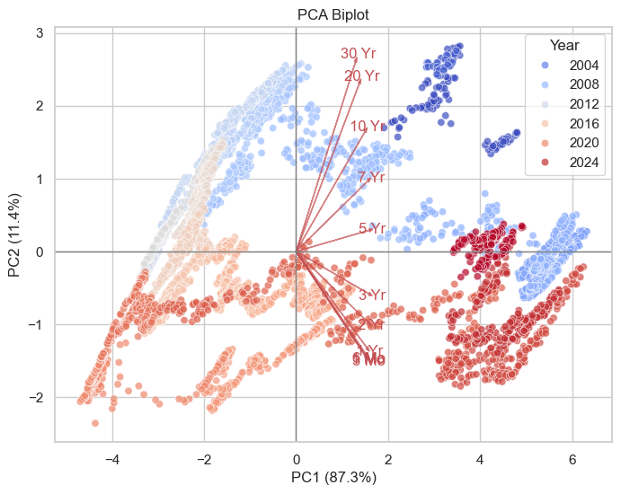
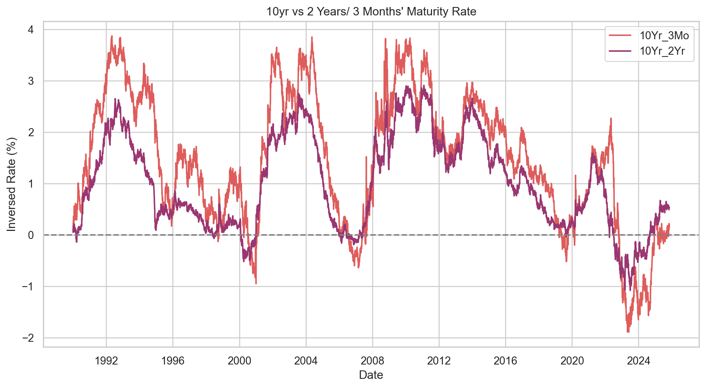
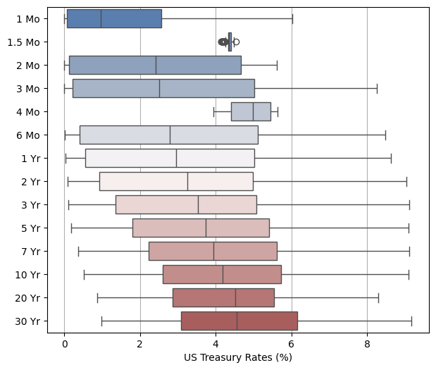

### ***Data Science / Plant Lover / Climber***
*"The flow state, often called “being in the zone,” is a mental state where you are fully absorbed in an activity,and losing track of time."*

Glad you are here! This website is to showcase Samantha's skills and passions and ultimately to inspire you to pursue what you love, aka being in the flow! 

<!-- ##### **You can find me here:**

- 💼 [LinkedIn](https://www.linkedin.com/in/samantha-p5221/)
- 🧑‍💻 [GitHub](https://github.com/Pylon521)
- 😎 [Instagram](https://www.instagram.com/365bench/) -->
✉️ Contact: [theflow365@emailhub.kr](mailto:theflow365@emailhub.kr)

#### Samantha's Latest Projects:

<a href="PCA.qmd" class="project-item">
  
  

  
Treasury Yields PCA

  
Published: Oct 2025

  
Applying Principal Component Analysis (PCA) to treasury yields to identify primary drivers of yield curve movements, such as level, slope, and curvature.

  

</a>

<a href="invertedYieldCurve.qmd" class="project-item">
  
  

  
Inverted Yield Curve Analysis

  
Published: Oct 2025

  
Analyzing historical inverted yield curve data to explore its correlation with past economic recessions and predict future trends.

  

</a>

<a href="webScraper.qmd" class="project-item">
  
  

  
US Treasury Bond Web Scraper

  
Published: Oct 2025

  
Web scraping US Treasury Rate site with step by step ETL.

  

</a>

