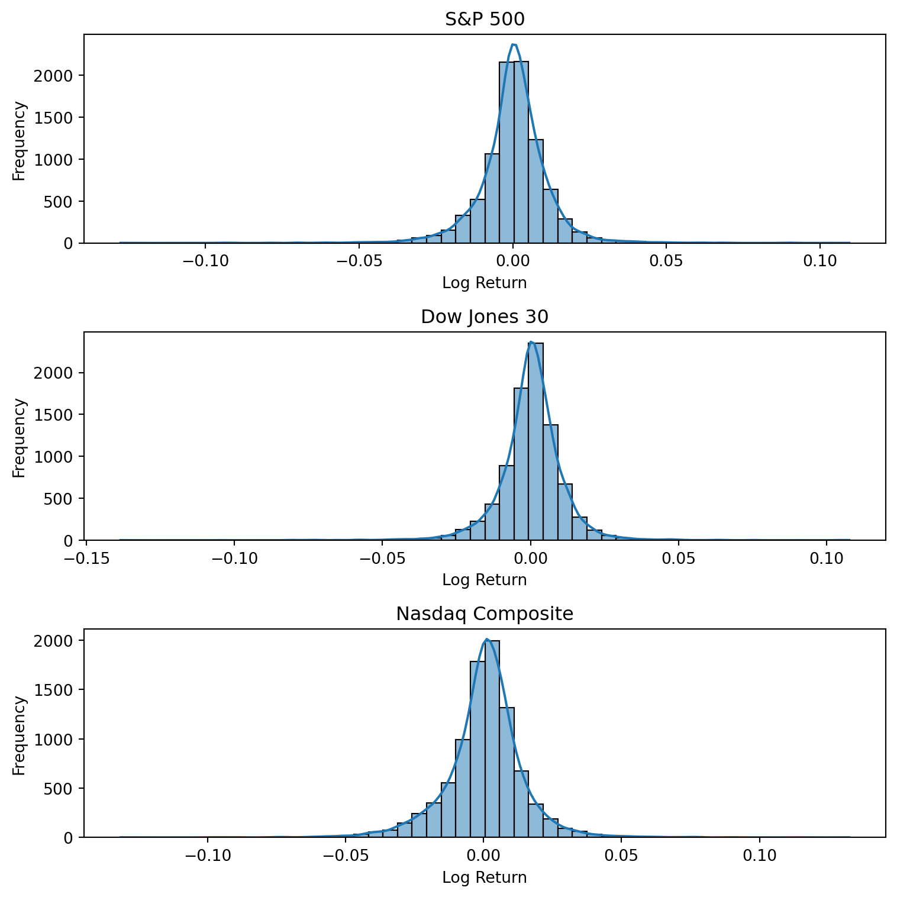

<!-- #### ***Data Science / Plant Lover / Runner*** -->
*"The flow state, often called “being in the zone,” is a mental state where you are fully absorbed in an activity,and losing track of time."*

Glad you are here! This website is to showcase Samantha's skills and passions and ultimately to inspire you to pursue what you love, aka being in the flow!

See all projects [here](analysis.qmd) 🤓

✉️ Contact: [theflow365@emailhub.kr](mailto:theflow365@emailhub.kr)

#### Samantha's Latest Project:

<a href="marketTrendAnalysis.qmd" class="project-item">
  
  

  
Market Trend Distribution Analysis

  
Published: Dec 2025

  
 Analyzing long-term trends, returns, and volatility of major U.S. stock indices: S&P 500, Dow Jones, and NASDAQ.

  

</a>

